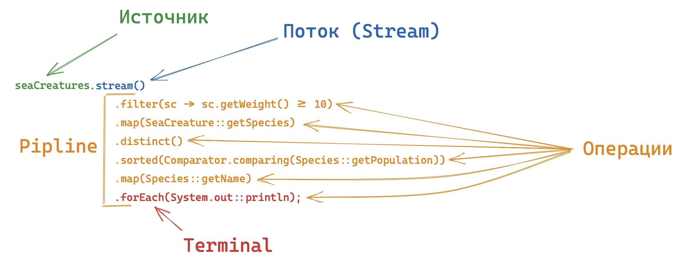

> [!important]  Важно!
Именно терминальная операция запускает выполнение потока. После ее вызова происходит анализ операций в пайплайне, и определяется эффективная стратегия его выполнения.

## Statefull & Stateless operations

- Операции без состояния, такие как **`map()`** и **`filter()`**, обрабатывают каждый элемент потока независимо от других. Они не требуют информации о предыдущих или последующих элементах для своей работы, что делает их *идеально подходящими для параллельной обработки*. Например, в методе **`filter()`** каждый элемент проверяется по заданному условию отдельно, и его результат не зависит от других элементов.

- Операции с состоянием, такие как **`sorted()`**, **`distinct()`** или **`limit()`**, требуют информации о других элементах потока. Эти операции не могут начать возвращать результаты, пока не обработают часть или весь поток. Например, **`sorted()`** должна сначала собрать все элементы, чтобы их отсортировать, а затем уже передать их на последующие этапы.

- Если в пайплайне используются только операции без состояния, то поток может быть обработан *в один проход*, что делает выполнение быстрым и эффективным. Однако при добавлении операций с состоянием (как в примере ниже **`sorted()`**) поток делится на секции, и каждая секция должна завершить свою обработку перед началом следующей.

```java
getCustomers().stream()  
        .filter(x -> {  
            System.out.println("Filtering under 30 - " + x.getName());  
            return x.getAge() < 30;  
        })  
        .map(x -> {  
            System.out.println("Mapping into Stream<String> - " + x.getName());  
            return x.getName();  
        })  
        .sorted()  
        .forEach(x -> System.out.println("Foreach - " + x));
```

```
Filtering under 30 - Nikita
Mapping into Stream<String> - Nikita
Filtering under 30 - Anna
Filtering under 30 - Ivan
Filtering under 30 - Maria
Mapping into Stream<String> - Maria
Filtering under 30 - Dmitry
Filtering under 30 - Olga
Filtering under 30 - Sergey
Filtering under 30 - Elena
Mapping into Stream<String> - Elena
Filtering under 30 - Pavel
Filtering under 30 - Tatiana
Foreach - Elena
Foreach - Maria
Foreach - Nikita
```


## Параллельное выполнение

Его можно запустить используя функцию **`parallel()`** либо **`parallelStream()`**. Под капотом используется *ForkJoinPool*     
> [!FAQ]- Какие операции подходят для parallel?
> Нужно объяснение и пример в коде.


Java использует ==`ForkJoinPool` для распределения задач параллельных потоков. Это общий пул потоков==

Список источников:
- https://struchkov.dev/blog/ru/java-stream-api/